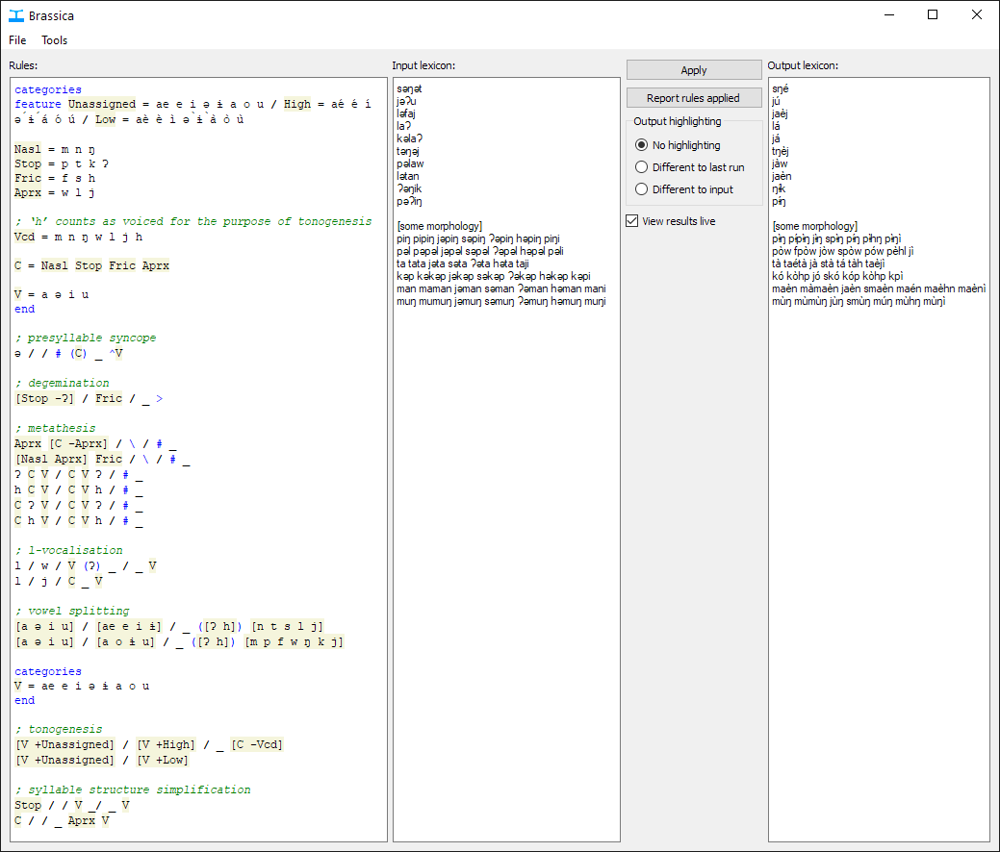

# Brassica

Brassica is a new sound change applier with the following features:

- Can be used in both interactive (GUI) and batch mode, as well as a Haskell library
- Intuitive syntax based on Mark Rosenfelder’s [SCA²](https://www.zompist.com/sca2.html)
- First-class support for multigraphs
- Live preview and control over output highlighting allow fast iteration through rules
- Tabular ‘rules applied’ output helps with debugging
- Comes with built-in paradigm builder
- Rich syntax for specifying phonetic rules: includes wildcards, optional elements and more
- Category operations allow phonetic rules to be written featurally
- Support for ‘features’ lets rules easily manipulate stress, tone and other suprasegmentals
- Easy control over rule application: apply rules right-to-left and left-to-right, one time or multiple times

See the [documentation](./DOCUMENTATION.md) for details on Brassica usage.

Download Brassica from the [releases page](https://github.com/bradrn/brassica/releases/latest).
As of the time of writing prebuilt binaries exist only for Windows.
Instructions for building from source should be coming soon;
  but until then, good luck building it on other platforms.

