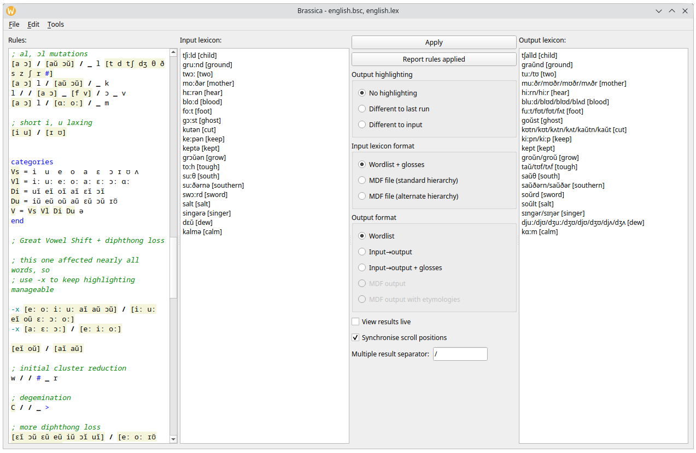

# Brassica

Brassica is a sound change applier: a program to simulate the evolution of language over time.

Brassica’s features include:

- A choice of four different platforms: you can use Brassica interactively [online](https://bradrn.com/brassica/index.html) or as a standalone application,
    non-interactively on the command-line, or as a [Haskell library](https://hackage.haskell.org/package/brassica)
- Being well-tested, including several automated test suites, as well as example files with sound changes from natural languages
- First-class support for suprasegmental features, such as stress and tone
- Easy control over rule application: apply sound changes iteratively, sporadically, right-to-left, between words, and in many more ways
- Native support for the MDF dictionary format, also used by tools including [SIL Toolbox](https://software.sil.org/toolbox/) and [Lexique Pro](https://software.sil.org/lexiquepro/)
- A comprehensive user interface with live preview and highlighting for both sound changes and output
- Comes with a [paradigm builder](https://bradrn.com/brassica/builder.html) for quickly investigating inflectional and other patterns

And many more!

See the [documentation](./docs) for details on Brassica usage,
  and the [example files](./examples) for examples of practical usage.

Download Brassica from the [releases page](https://github.com/bradrn/brassica/releases/latest).
Alternately, try it online at http://bradrn.com/brassica.
As of the time of writing prebuilt binaries exist for Windows and Linux.
Instructions for building from source are available at [`BUILDING.md`](./BUILDING.md).

