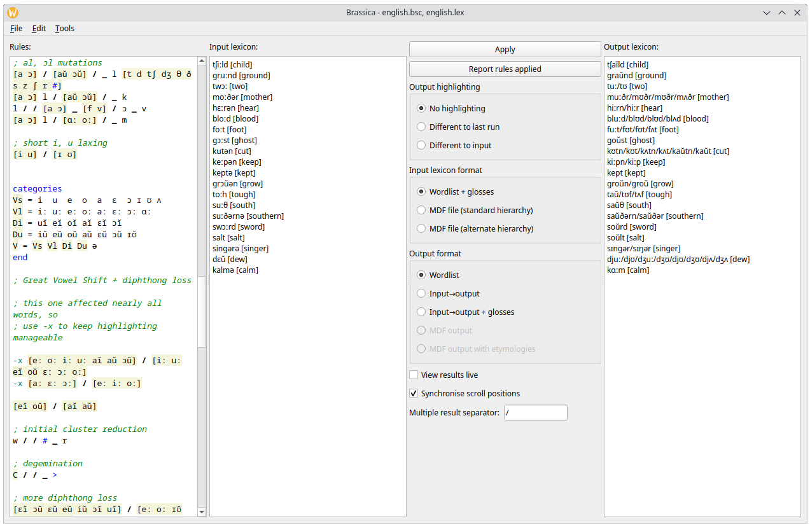

<!-- -*-GFM-*- -->

# Using Brassica

This guide is about how to use Brassica’s graphical interface.
See the other guides to learn how to write sound changes in Brassica syntax.

## Versions of Brassica

Four interfaces to Brassica are available:

- As a **webpage**, accessible online at https://bradrn.com/brassica
- As a standalone **desktop** application, which can be downloaded for Windows and Linux at https://github.com/bradrn/brassica/releases
- As a **command-line** application, available from the same link
- As a **library**, available [on Hackage](https://hackage.haskell.org/package/brassica)

All of these use the same sound change syntax and the same rule application engine.
However, each one is best suited for a slightly different purpose.

The web and desktop interfaces are most suitable for interactive use,
  and form the focus of this document.
For the most part they have the same features and behave the same way:
  the most significant difference is that the desktop application is faster.
It is recommended to use the desktop version if you can.

The command-line interface is best suited for batch processing of large wordlists,
  or as a part of longer data processing pipelines.
Invoke it with the `--help` argument to see documentation.
Most options have counterparts in the graphical interface, to which they behave similarly.

A Haskell library is provided to allow for embedding into other programs.
It is documented at the Hackage link above.
The library allows sound changes to be written as Haskell programs,
  or can process Brassica syntax as normal.
  
## Components of the graphical interface

The graphical interface appears as follows:

(This is a screenshot of the desktop version.
The web version should appear similar to this.
This screenshot shows the ‘Middle to Modern English’ set of example files.)

For normal usage,
  enter your sound change rules in the leftmost textbox,
  and your input words in the textbox second from the left.
Then press the ‘Apply’ button to view the result of applying your rules to your lexicon.
Alternately, you can select ‘Report rules applied’:
  this will display a table showing the evolution of each word as it was modified by the sound changes.

In more detail, the four components of the main window are, from left to right:

- A textbox for **rules**,
    in which the sound changes to be applied are described.
  Syntax highlighting is provided for categories and other symbols with special meaning to Brassica.
- A textbox for the **input lexicon**,
    in which the words to which the sound changes will be applied are entered.
- A **control pane** to trigger rule application, and to adjust its behaviour.
  The controls here will be described in more detail below.
- A box in which the **output lexicon** will be displayed after rule application.
  By default, this box is scrolled to the same position as that of the input lexicon:
    disable this by unchecking the option to ‘Synchronise scroll positions’
    (near bottom of the control pane).

(The syntax for sound change rules and the input lexicon is described in the other help documents.)

On the desktop version only, there are three menu items:

- The ‘File’ menu lets you open or save the sound change rules or the input lexicon.
  These two textboxes are treated separately, rather than being merged in a single file.
  This is so you can, for instance,
    apply one set of sound changes to several different words files,
    or apply different sets of sound changes to a single list of protoforms.

  (In the web version, you can open and download sound changes using buttons above each textbox instead.)

- The ‘Edit’ menu provides usual editor commands
  A ‘Find’ dialog lets you search for text in any of the three textboxes.

- The ‘Tools’ menu lets you open two tools:
  - The **paradigm builder**, documented in a separate guide [TODO write this].
  - The options dialog, currently restricted to **setting the desired font** for each textbox.
  
- The ‘Help’ menu contains help and information about Brassica.

Also on desktop only, there are two keyboard shortcuts:

- Ctrl+Tab switches focus between the rules textbox and the input lexicon textbox.
- Ctrl+Enter applies the rules to the input lexicon, as if the ‘Apply’ were pressed.

## Rule application

The most important elements of the control pane are the two buttons at the top.
These cause the rules to be applied to the input, and place the results into the output box.
The **Apply** button simply does the application,
  and displays the output words as specified by the other settings in the control pane.
(As mentioned above, on desktop pressing Ctrl+Enter does the same thing.)
By contrast, **Report rules applied** displays not only the input and output words,
  but every sound change which applied to the input to produce the output,
  alongside all the intermediate forms.

Another way to apply rules is by selecting the **View results live** checkbox
  (near the bottom of the control pane).
When this is selected, the rules will be re-applied to the input lexicon
  whenever either textbox is modified,
  and whenever any controls are changed.
This can sometimes be slow so this checkbox is disabled by default.

## Output highlighting

Brassica can **highlight** output words under specific conditions (by displaying them in boldface).
This is configured by the controls immediately under the rule application buttons.
The default is to have ‘No highlighting’.

When **Different to last run** is selected,
  output words are highlighted
  whenever they are different to the words which were previously in the output box.
This can happen if they were added or changed compared to the last rule application run.
Brassica attempts to highlight only the specific words which changed;
  however, in rare situations it can highlight more words than necessary.

When **Any rule applied** is selected,
  Brassica highlights all word which were affected by any sound change rule.
Thus, if all words are highlighted,
  this means that at least one sound change has applied to every word.
The exception is sound changes which are flagged with `-x`:
  these are ignored by sound change highlighting.
(This is useful for rules for romanisation and similar,
  which are not ‘meaningful’ sound changes but will often affect many words.)
  
## Input and output format

Brassica can accept input in two formats.
For each of these, it can produce output in several formats.
These are determined by the controls in the bottom half of the control pane.

The default input format is ‘Wordlist + glosses’.
This is the usual Brassica format described in the other guides:
  a list of words separated by whitespace, alongside glosses surrounded by square brackets.
Three output formats are available when this input format is selected:

- **Wordlist + glosses**: the same format as the input.
  When a word produces multiple results,
    those results are separated by the ‘Multiple result separator’ option
    (at the bottom of the control pane — by default a forward slash).
- **Input→output**: for each word,
    shows the input followed by the output (plus any intermediate forms),
    separated by arrows.
- **Input→output + glosses**: same as ‘input→output’,
    but including glosses and any extra whitespace from the input.

Alternately, Brassica can accept dictionaries written with the Multi-Dictionary Formatter (‘MDF’).
For more on using this format, refer to
  [Coward & Grimes (2000)](http://downloads.sil.org/legacy/shoebox/MDF_2000.pdf).
Brassica supports two different conventions for marker hierarchies:
- The ‘standard hierarchy’ places ‘part of speech’ above ‘sense number’ (`\se` > `\ps` > `\sn`)
- The ‘alternate hierarchy’ places ‘part of speech’ below ‘sense number’ (`\sn` > `\se` > `\ps`)
Both these hierarchies are supported by SIL software such as [Toolbox](https://software.sil.org/toolbox/).

Brassica will automatically select ‘MDF file (standard format)’ when an MDF dictionary file is opened.
(It is expected that such a file will have file extension `.txt` or `.mdf`.)
The input format can be changed to the alternate hierarchy if desired.
When either of those MDF formats are selected, the output options are as follows:

- The options described above are still available:
    these will print all ‘vernacular’ words to which the sound changes were applied.
- **MDF output** displays the output in MDF format, preserving the structure of the input.
- **MDF output with etymologies** displays the output in MDF format,
    but additionally adds etymologies (`\et` and/or `\eg` fields)
    corresponding to the input words.
